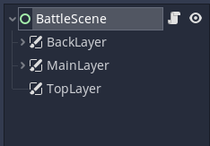

# Interface Mock-up

## Choosing a Baseline

One of the major aspects of a turn-based battle game is the *interface* of the battle scene.
This is something that should be planned early on, and something that should accomodate all the features on the roadmap.

In this case, the interface is highly inspired in the game [Hearthstone: Mercenaries](https://playhearthstone.com/en-gb/news/23699737/prepare-for-mercenaries-coming-october-12).

More specifically, here are some features that we want to implement:

- a game board with minions battling each other;
- minions placed in a 3v3 arrangement;
- an action bar to choose the skill each minion is going to use in the current turn;
- three available actions/skills per minion;
- skills with Speed and Cooldown attributes;
- the ability to undo a choice;
- the ability to skip a turn with a minion;
- some way to display turn order.

As for the minions themselves, we want to display:

- a picture;
- an indicator of the minion's Attack and Health values;
- an indicator of the minion's Speed (once an action is chosen).

Granted, this type of game has room for much more, but defining long-term objectives beyond our reach - and without getting a feel of the actual implemented game - only serves to undermine the development process.

## Defining Structure

Now that we have a baseline, we can start designing a mock-up of this interface.
One of the first things to do is to identify conceptual **layers** in the interface.

This is something you can do even with pen and paper.
Just draw a mock-up of your interface, identify its main elements, and decide what goes on top of what.
Which parts are static? Which parts need movement/animation? Which parts should always be visible?

A good rule of thumb for a simple/minimalistic game is to split entities among **3 layers**:

1. the *background* layer, mostly for static things, such as a background image;
2. the *main* layer, or the *object* layer, sitting on top of the background, is where we want to place the main/moveable entities of our game, such as minions;
3. the *top* layer, or the *UI/HUD* layer, for elements that should always be visible (and likely static) on the screen.

In this tutorial, though, we are going to keep things simple.
We will only be using the main/middle layer.

Another big question is whether we want `Node2D` or `Control` nodes.
We are going for a relatively static game in this tutorial, so `Control` is the best choice.
Besides, building a user interface is our major focus, and `Control` nodes are much better suited for that.

With that said, create a new `Control` scene, under `scenes/battle`, and name it `BattleScene`.
Add three `CanvasLayer` child nodes to the `BattleScene`.

