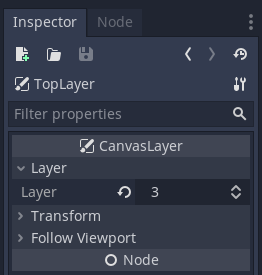
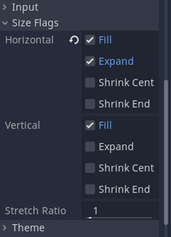

# Interface Mock-up

## Choosing a Baseline

One of the major aspects of a turn-based battle game is the *interface* of the battle scene.
This is something that should be planned early on, and something that should accomodate all the features on the roadmap.

In this case, the interface is highly inspired in the game [Hearthstone: Mercenaries](https://playhearthstone.com/en-gb/news/23699737/prepare-for-mercenaries-coming-october-12).

More specifically, here are some features that we want to implement:

- a game board with minions battling each other;
- minions placed in a 3v3 arrangement;
- an action bar to choose the skill each minion is going to use in the current turn;
- three available actions/skills per minion;
- skills with Speed and Cooldown attributes;
- the ability to undo a choice;
- the ability to skip a turn with a minion;
- some way to display turn order.

As for the minions themselves, we want to display:

- a picture;
- an indicator of the minion's Attack and Health values;
- an indicator of the minion's Speed (once an action is chosen).

Granted, this type of game has room for much more, but defining long-term objectives beyond our reach and, without getting a feel of the actual implemented game, it only serves to undermine the development process.

## Defining Structure

Now that we have a baseline, we can start designing a mock-up of this interface.
One of the first things to do is to identify conceptual **layers** in the interface.

This is something you can do even with pen and paper.
Just draw a mock-up of your interface, identify its main elements, and decide what goes on top of what.
Which parts are static? Which parts need movement/animation? Which parts should always be visible?

A good rule of thumb for a simple/minimalistic game is to split entities among **3 layers**:

1. the *background* layer, mostly for static things, such as a background image;
2. the *main* layer, or the *object* layer, sitting on top of the background, is where we want to place the main/moveable entities of our game, such as minions;
3. the *top* layer, or the *UI/HUD* layer, for elements that should always be visible (and likely static) on the screen.

In this tutorial, though, we are going to keep things simple.
We will only be using the main/middle layer, but we will include the other layers regardless, to make it easier to extend the game later on.

Another big question is whether we want `Node2D` or `Control` nodes.
We are going for a relatively static game in this tutorial, so `Control` is the best choice.
Besides, building a user interface is our major focus, and `Control` nodes are much better suited for that.

With that said, create a new `Control` scene, under `scenes/battle`, and name it `BattleScene`.
Add three `CanvasLayer` child nodes to the `BattleScene` and attach a new script to it.

Even though we are not using all layers in this tutorial, do not forget to change the *Layer* property of each `CanvasLayer`, to guarantee their order.
Set the `BackLayer` to 1, the `MainLayer` to 2 and the `TopLayer` to 3.

Next, we are going to lay out the main elements and containers for the game interface.

## Laying Out Components

Looking at the mock-up for our interface, or the example picture for the *Hearthstone: Mercenaries* game, we can easily identify some of the main UI elements:

- the *history* bar at the left;
- the central *battle area*;
- the *bench/party* bar at the right.

These elements are organized horizontally, so start by adding a `HBoxContainer` child node under the `MainLayer`.
Call it `HBox`.
Since this is our top-level container, set its *Layout* to *Full Rect*.

We will not implement the left and right bars in this tutorial, but we still want to have some placeholder in their place.
We will use `PanelContainer` nodes for this purpose.

Let's focus on the battle area next.
Its elements are laid out vertically for the most part, so a `VBoxContainer` node is a good candidate.
We will make some adjustments, compared to *Hearthstone: Mercenaries*, such as moving the main action bar to the bottom.

Let us add these three children under the `HBox`.

1. Add a `PanelContainer` called `LPanel`. This is the placeholder for the *history* bar.
2. Add a `VBoxContainer` called `BattleArea`.
3. Add a `PanelContainer` called `RPanel`. This is the placeholder for the *bench* bar.

Feel free to mess with the *Separation* property of the `HBox`, under *Custom Constants*.
You can leave it as it is, or define how far apart each element should be.

Let's focus now on the central battle area.

This area is supposed to be the main focus of our game, and it should take as much space as possible.
Change its *Size Flags* in the node Inspector. Make sure to check *Expand* under the horizontal flags.

