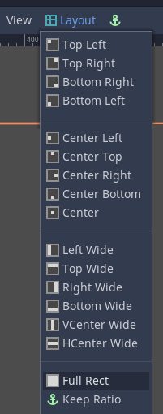
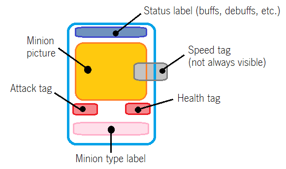
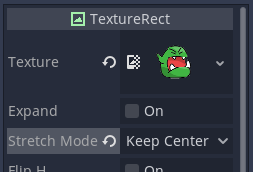
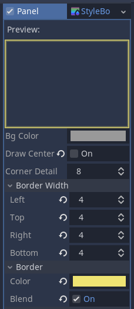
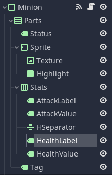
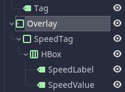
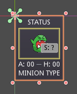
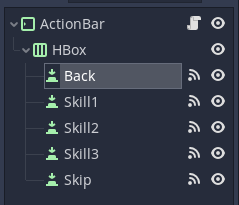

# Interface Mock-up

## Choosing a Baseline

One of the major aspects of a turn-based battle game is the *interface* of the battle scene.
This is something that should be planned early on, and something that should accomodate all the features on the roadmap.

In this case, the interface is highly inspired in the game [Hearthstone: Mercenaries](https://playhearthstone.com/en-gb/news/23699737/prepare-for-mercenaries-coming-october-12).

More specifically, here are some features that we want to implement:

- a game board with minions battling each other;
- minions placed in a 3v3 arrangement;
- an action bar to choose the skill each minion is going to use in the current turn;
- three available actions/skills per minion;
- skills with Speed and Cooldown attributes;
- the ability to undo a choice;
- the ability to skip a turn with a minion;
- some way to display turn order.

As for the minions themselves, we want to display:

- a picture;
- an indicator of the minion's Attack and Health values;
- an indicator of the minion's Speed (once an action is chosen).

Granted, this type of game has room for much more, but defining long-term objectives beyond our reach and, without getting a feel of the actual implemented game, it only serves to undermine the development process.

## Defining Structure

Now that we have a baseline, we can start designing a mock-up of this interface.
One of the first things to do is to identify conceptual **layers** in the interface.

This is something you can do even with pen and paper.
Just draw a mock-up of your interface, identify its main elements, and decide what goes on top of what.
Which parts are static? Which parts need movement/animation? Which parts should always be visible?

A good rule of thumb for a simple/minimalistic game is to split entities among **3 layers**:

1. the *background* layer, mostly for static things, such as a background image;
2. the *main* layer, or the *object* layer, sitting on top of the background, is where we want to place the main/moveable entities of our game, such as minions;
3. the *top* layer, or the *UI/HUD* layer, for elements that should always be visible (and likely static) on the screen.

In this tutorial, though, we are going to keep things simple.
We will only be using the main/middle layer, but we will include the other layers regardless, to make it easier to extend the game later on.

Another big question is whether we want `Node2D` or `Control` nodes.
We are going for a relatively static game in this tutorial, so `Control` is the best choice.
Besides, building a user interface is our major focus, and `Control` nodes are much better suited for that.

With that said, create a new `Control` scene, under `scenes/battle`, and name it `BattleScene`.
Add three `CanvasLayer` child nodes to the `BattleScene` and attach a new script to it.

Even though we are not using all layers in this tutorial, do not forget to change the *Layer* property of each `CanvasLayer`, to guarantee their order.
Set the `BackLayer` to 1, the `MainLayer` to 2 and the `TopLayer` to 3.

Next, we are going to lay out the main elements and containers for the game interface.

## Laying Out Components

Looking at the mock-up for our interface, or the example picture for the *Hearthstone: Mercenaries* game, we can easily identify some of the main UI elements:

- the *history* bar at the left;
- the central *battle area*;
- the *bench/party* bar at the right.

These elements are organized horizontally, so start by adding a `HBoxContainer` child node under the `MainLayer`.
Call it `HBox`.
Since this is our top-level container, set its *Layout* to *Full Rect*.

We will not implement the left and right bars in this tutorial, but we still want to have some placeholder in their place.
We will use `PanelContainer` nodes for this purpose.

Let's focus on the battle area next.
Its elements are laid out vertically for the most part, so a `VBoxContainer` node is a good candidate.
We will make some adjustments, compared to *Hearthstone: Mercenaries*, such as moving the main action bar to the bottom.

Let us add these three children under the `HBox`.

1. Add a `PanelContainer` called `LPanel`. This is the placeholder for the *history* bar.
2. Add a `VBoxContainer` called `BattleArea`.
3. Add a `PanelContainer` called `RPanel`. This is the placeholder for the *bench* bar.

Feel free to mess with the *Separation* property of the `HBox`, under *Custom Constants*.
You can leave it as it is, or define how far apart each element should be.

Let's focus now on the central battle area.

This area is supposed to be the main focus of our game, and it should take as much space as possible.
Change its *Size Flags* in the node Inspector. Make sure to check *Expand* under the horizontal flags.

We can identify two main sub-areas within the battle area: the **action bar**, and the actual **battle arena**.
The action bar is going to be implemented in its own scene, and should be placed at the bottom.
Just use `PanelContainer` as a placeholder.
For the core battle area, we will use another `VBoxContainer`, called `Battlers`.

**Optional:** to keep the action bar at the bottom, change the *Alignment* property of the `BattleArea` container, in the node Inspector, to *End*.
In addition, change the *Size Flags* of the new `Battlers` container, and make sure to check *Expand* both in the Horizontal and in the Vertical sections.

Change the *Alignment* of the new `Battlers` container to *Center*, so our minions battle at the center of this area.

Speaking of which, how should we lay out the main participants of the battle interface?
This should be easy.
They are organized in two rows, so we can use two `HBoxContainer`, called `EnemyTeam` and `PlayerTeam`, to display the enemy minions and the player minions, respectively.
Just for decoration, we are going to add an `HSeparator` node in between the rows of minions (it can be safely removed later, if you add a background image).

Lastly, we are missing some minions.
These will be implemented in their own scene too, so just add three `PanelContainer` under each team for placeholders.

## The Minion Scene

For minions, we want to display them in some kind of portrait, as shown in the sketch below.

To simplify things, create a new `Minion` scene, under `scenes/battle`, and choose `PanelContainer` for its root node.
This node is not supposed to take up the whole screen, so, under *Layout*, set it to *Top Left*.

We are going to display the various sub-elements of a minion vertically, except for the Speed tag (more on that later).
Add a `VBoxContainer` to the new `Minion` container, call it `Parts`.

Now, let's add the various sub-elements of a minion under `Parts`.

1. Add a `Label` node, call it `Status`. This is for the status conditions (unused in this tutorial). Under its *Vertical Size Flags*, uncheck *Fill* and check *Shrink Center*.
2. Add a `MarginContainer` node, call it `Sprite`. This is where the picture will go. Under its *Size Flags* check *Expand*, both horizontally and vertically.
3. Add an `HBoxContainer` node, call it `Stats`. This is where *Attack* and *Health* will go.
4. Add a `Label` node, call it `Tag`. This is where the minion type will be displayed (unused in this tutorial). Under its *Vertical Size Flags*, uncheck *Fill* and check *Shrink Center*.

Under the `Sprite` node, we are going to add a `TextureRect` node, called `Texture`.
This will hold the minion's picture.
You can set the desired texture right away.
Remember to change its *Stretch Mode* to *Keep Centered* in the node Inspector.

Next, add a `Panel` node under `Sprite`, and call it `Highlight`.
This will be used to show a highlight on the minion's portrait later on, when the mouse hovers over the minion, or when it is the minion's turn.

To stylize this panel, go to *Custom Styles* in the node Inspector and add a new `StyleBoxFlat`.
Change its attributes as you see fit, or take the following suggestions.

Now, under the `Stats` container, we are going to add the following children.

1. `Label` node called `AttackLabel` with the text `A:`.
2. `Label` node called `AttackValue` (with the optional text `00` or `?`).
3. `HSeparator` node, with its horizontal *Size Flags* checking *Expand*.
4. `Label` node called `HealthValue` with the text `H:`.
5. `Label` node called `HealthValue` (with the optional text `00` or `?`).

And that makes up most of our minion portrait.
It should be looking like the following.

We are just missing the Speed tag, which is going to have a special placement.
Directly under `Minion`, and after `Parts`, add a new `MarginContainer` node.
Call it `Overlay`.
Optionally, set some custom margins for it, under *Custom Constants*  in the node Inspector.
Set all margins, for example, to 4 pixels.

Under the new `Overlay`, we are going to add a `PanelContainer` node, called `SpeedTag`.
Change its *Size Flags* to *Shrink End*, horizontally, and to *Shrink Center*, vertically.
Under *Custom Styles*, in the node Inspector, feel free to add a new `StyleBoxFlat` and stylize it.

Lastly, under the new `SpeedTag`, we are going to add an `HBoxContainer`, called `HBox`, and, under that, add two `Label` nodes.
The first label is called `SpeedLabel`, with the text `S:`, and the second one is called `SpeedValue`, with the text `?` (just like for *Attack* and *Health* before).

Our Minion scene should now be looking similar to this:

Logic and animation will be discussed later on in the tutorial.

## The Action Bar Scene

The action bar will be our main interactive object in the game.
It should allow us to select one out of three minion skills.
In addition, there should also be an option to skip a turn (do nothing) with a minion.

Lastly, in this game we select all the actions for our minions (one at a time) first, and only then does the game proceed into an action resolution phase.
It would be nice to have a way to revert our previous choices, in the action selection phase, should we make a mistake.

Summing up, our action bar is, then, a simple panel with a total of 5 buttons.

The minion skill buttons should be dynamic; we want to change the buttons' text according to the skills the minion knows.

Start by creating a new `ActionBar` scene under `scenes/battle`.
The root node should be a `MarginContainer`.

Set the *Layout* of the action bar to *Bottom Wide*, and, in the node Inspector, change its `y` *Rect/Min. Size* to 40.
Optionally, under *Custom Constants* set its *Margin Bottom* to 8.

Attach a script to the `ActionBar`, so that we can implement its logic later on.

Now, we want to display our buttons horizontally.
This should be straightforward.
Add an `HBoxContainer` child node, called `HBox`, to the action bar.
Change its *Alignment* property, in the node Inspector, to *Center*.
Then, add 5 `Button` children to the `HBox`.

The five buttons should be:

1. `Back`, a button to revert our previous choice.
2. `Skill1`, a button to hold a minion's first skill.
3. `SKill2`, a button to hold a minion's second skill.
4. `Skill3`, a button to hold a minion's third skill.
5. `Skip`, a button to skip a turn (do nothing) with a minion.

With that, we should have a layout similar to the previous picture, and a node tree similar to the following.

This concludes our interface layout.
All that is left now is to implement the game's logic and add some finishing touches, such as a few simple animations.
